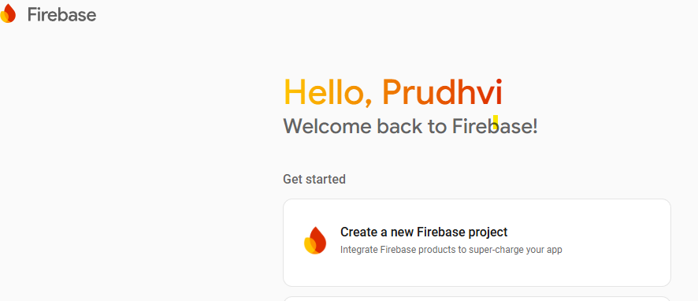
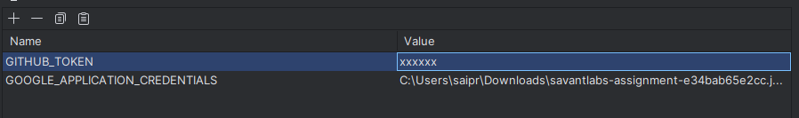

# GitHub to Firestore Issues Sync Agent

Connector framework to fetch GitHub issues for a given repository and store them in Google Firestore.
It demonstrates integration with GitHub REST API and Firestore SDK, with proper handling of rate limits,
errors, retries, and clean code practices.

---

## GitHub REST API References

### List repository issues
Lists issues for the specified repository.
Reference: https://docs.github.com/en/rest/issues/issues?apiVersion=2022-11-28#list-repository-issues

---

## Firestore initial setup
### Create Firebase Project
- Go to Firebase Console and create a project by clicking on create new firebase project. (https://console.firebase.google.com/u/0/)


### Download Service Account Key (make it clean)
- In Project Settings -> Service Accounts, generate a new private key.

Save the JSON file (e.g., firebase-service-account.json) inside your project.

### Configure Firestore Authentication
- For demo purposes, update Firestore rules to allow public read access so external users can query documents via REST API without authentication.
- In a real production setup, we should keep proper authentication and access rules enabled.

---

## Tech Stack

- **Java 17+**
- **Spring Boot**
- **Maven**
- **GitHub REST API**
- **Google Firestore (Firebase)**

---

## Features Implemented

- Authenticates to Firestore using a service account JSON key.
- Fetches issues from a GitHub repository.
- Transforms and stores fields in Firestore: id, title, state, html_url, created_at
- Handles 401 Unauthorized, 403 Forbidden, and 404 Not Found errors.
- Retries transient network/server errors with exponential backoff.
- Handles rate limits.
- Avoids duplicates by using GitHub issue.id as Firestore document ID.
- Supports fetching the top N most recent issues from large repositories.

---

## Local Setup to Run the REST API

- Clone the project locally and import it as a Maven project
- Add the environment variables as shown below..

- Start the application either from your IDE run option or by using the command:
```bash
  mvn spring-boot:run
 ```
- Once the application is running, use the following endpoint:
  - This endpoint calls the GitHub REST API and syncs issues into Firestore.
  - For demo purposes, the endpoint runs synchronously (it returns the response only after the sync is complete).
  - In production, this should be implemented asynchronously with an event-driven pipeline and proper status tracking.

### Request:
- owner: 
  - The GitHub account that owns the repository.
  - Can be a user (e.g., "octocat") or an organization (e.g., "google").

- repository
  - The repository name under the given owner.
  - Example: "hello-world" corresponds to https://github.com/octocat/hello-world.

- syncIssuesType
  - Specifies which adapter implementation to use for syncing issues.
  - Currently supported:
    - "GIT_HUB_REPOSITORY_FIRESTORE" sync issues into Firestore.
  - Future extensions can include other sinks like "GIT_HUB_REPOSITORY_JIRA".

- limit
  - The maximum number of recent issues to fetch from GitHub.

```curl
  curl --location 'http://localhost:8080/api/v1/sync/issues' \
--header 'Content-Type: application/json' \
--data '{
    "owner": "octocat",
    "repository": "hello-world",
    "syncIssuesType": "GIT_HUB_REPOSITORY_FIRESTORE",
    "limit": 5
}'
```
### Response:
- owner:
    - The GitHub account that owns the repository.
    - Can be a user (e.g., "octocat") or an organization (e.g., "google").

- repository
    - The repository name under the given owner.
    - Example: "hello-world"
  
- requested
  - The number of issues the client asked to fetch (from the request body limit).
  - Example: 5.

- saved
  - The actual number of issues that were successfully stored in Firestore.
  - Usually equals requested, but may be less if:
    - The repo has fewer issues than requested.
    - Some issues were skipped (e.g., pull requests filtered out).

```json
{
  "owner": "octocat",
  "repository": "hello-world",
  "requested": 5,
  "saved": 5
}
```
### View Firestore Data
- We can use the Firestore REST API to view synced documents:
### Request:
```curl
  curl --location 'https://firestore.googleapis.com/v1/projects/savantlabs-assignment/databases/(default)/documents/github-issues'
```

### Response:
- The response contains a list of documents stored in Firestore. Example:
```json
{
    "documents": [
        {
            "name": "projects/savantlabs-assignment/databases/(default)/documents/github-issues/3388796113",
            "fields": {
                "syncedAt": {
                    "stringValue": "2025-09-07T14:42:55.304965900Z"
                },
                "id": {
                    "stringValue": "3388796113"
                },
                "state": {
                    "stringValue": "open"
                },
                "title": {
                    "stringValue": "Test issue for MCP tool functionality"
                },
                "htmlUrl": {
                    "stringValue": "https://github.com/octocat/Hello-World/issues/4282"
                },
                "owner": {
                    "stringValue": "octocat"
                },
                "createdAt": {
                    "stringValue": "2025-09-05T21:17:44Z"
                },
                "repo": {
                    "stringValue": "hello-world"
                }
            },
            "createTime": "2025-09-07T11:15:30.468375Z",
            "updateTime": "2025-09-07T14:42:55.919854Z"
        },
        {
            "name": "projects/savantlabs-assignment/databases/(default)/documents/github-issues/3391476461",
            "fields": {
                "owner": {
                    "stringValue": "octocat"
                },
                "syncedAt": {
                    "stringValue": "2025-09-07T14:42:54.263988900Z"
                },
                "title": {
                    "stringValue": "Hello from the engine room"
                },
                "htmlUrl": {
                    "stringValue": "https://github.com/octocat/Hello-World/issues/4284"
                },
                "repo": {
                    "stringValue": "hello-world"
                },
                "createdAt": {
                    "stringValue": "2025-09-07T10:29:25Z"
                },
                "id": {
                    "stringValue": "3391476461"
                },
                "state": {
                    "stringValue": "open"
                }
            },
            "createTime": "2025-09-07T11:15:30.136252Z",
            "updateTime": "2025-09-07T14:42:55.483081Z"
        },
        {
            "name": "projects/savantlabs-assignment/databases/(default)/documents/github-issues/3391476491",
            "fields": {
                "repo": {
                    "stringValue": "hello-world"
                },
                "htmlUrl": {
                    "stringValue": "https://github.com/octocat/Hello-World/issues/4285"
                },
                "syncedAt": {
                    "stringValue": "2025-09-07T14:42:55.739159900Z"
                },
                "title": {
                    "stringValue": "Hello from the engine room"
                },
                "owner": {
                    "stringValue": "octocat"
                },
                "createdAt": {
                    "stringValue": "2025-09-07T10:29:27Z"
                },
                "id": {
                    "stringValue": "3391476491"
                },
                "state": {
                    "stringValue": "open"
                }
            },
            "createTime": "2025-09-07T11:15:28.941147Z",
            "updateTime": "2025-09-07T14:42:56.980200Z"
        },
        {
            "name": "projects/savantlabs-assignment/databases/(default)/documents/github-issues/3391476515",
            "fields": {
                "repo": {
                    "stringValue": "hello-world"
                },
                "state": {
                    "stringValue": "open"
                },
                "owner": {
                    "stringValue": "octocat"
                },
                "createdAt": {
                    "stringValue": "2025-09-07T10:29:30Z"
                },
                "syncedAt": {
                    "stringValue": "2025-09-07T14:42:50.425400Z"
                },
                "id": {
                    "stringValue": "3391476515"
                },
                "title": {
                    "stringValue": "Hello from the engine room"
                },
                "htmlUrl": {
                    "stringValue": "https://github.com/octocat/Hello-World/issues/4286"
                }
            },
            "createTime": "2025-09-07T11:15:28.540290Z",
            "updateTime": "2025-09-07T14:42:53.966177Z"
        }
    ]
}
```

## Bonus Extensions:
- Multi-tenant JIRA integration:
  - Extend design to sync GitHub issues into different JIRA systems for different users.
  - Add a jira_tenants collection with each tenant’s JIRA config (jiraUrl, projectKey, authToken).
  - Maintain an issue_sync_state collection mapping GitHub issue -> JIRA issue, including sync status and errors.
  - Implement GitHubIssueToJiraSyncAdapterImpl alongside Firestore adapter.